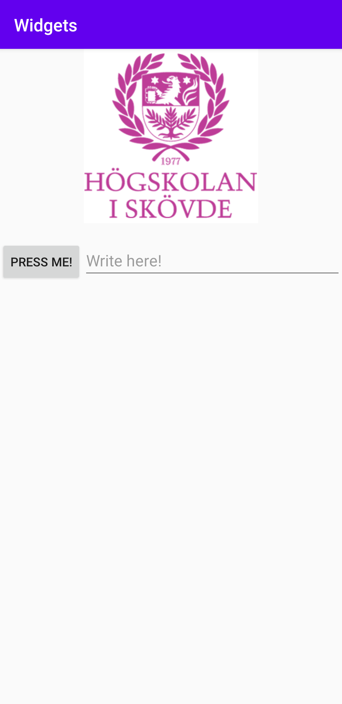

Rapport assignment 3 widgets

Kod och skärmdumpar


```
<LinearLayout xmlns:app="http://schemas.android.com/apk/res-auto"
    xmlns:tools="http://schemas.android.com/tools"
    xmlns:android="http://schemas.android.com/apk/res/android"
    android:layout_width="match_parent"
    android:layout_height="match_parent"
    android:orientation="vertical"
    tools:context=".MainActivity">

    <ImageView
        android:id="@+id/imageView3"
        android:layout_width="200dp"
        android:layout_height="200dp"
        android:contentDescription="his logo"
        app:srcCompat="@drawable/his"
        android:layout_gravity="center_horizontal"/>

    <LinearLayout
        android:layout_width="match_parent"
        android:layout_height="match_parent"
        android:orientation="horizontal"
        tools:context=".MainActivity"
        android:layout_marginTop="20dp">

        <Button
            android:id="@+id/myNewBtn"
            android:text="Press me!"
            android:layout_width="wrap_content"
            android:layout_height="wrap_content" />

        <EditText
            android:id="@+id/myNewEdt"
            android:hint="Write here!"
            android:layout_width="match_parent"
            android:layout_height="wrap_content" />
    </LinearLayout>
</LinearLayout>
```

Beskrivning av kod

Först skapas en linearlayout som har en vertikal orietering vilket gör att man kan lägga objekt under varandra, efter linearlayout skapas det en imageview med en bild på his loggan.
Loggan är i storleken 200 x 200dp och har en android:layout_gravity="center_horizontal" för att få loggan att ligga i mitten horisentellt men inte vetikalt.
Jag bestämde mig att jag ville ha button och edittext bredvid varandra så jag skapade en till linearlayout fast med horisontell orientering.
Till sist lade jag till en android:layout_marginTop"20dp" på den andra linearlayout för att få lite mellanrum mellan bilden, knappen och textfältet.
